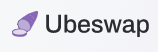

###### Add Liquidity

Ubeswap and SushiSwap will allow user to add liquidity to liquidity pool and return an amount of LP token.

### Ubeswap

[How to add liquidity in Ubeswap](https://docs.ubeswap.org/tutorial/providing-liquidity)

### Sushiswap

[SushiSwap doc](https://docs.sushi.com/)
