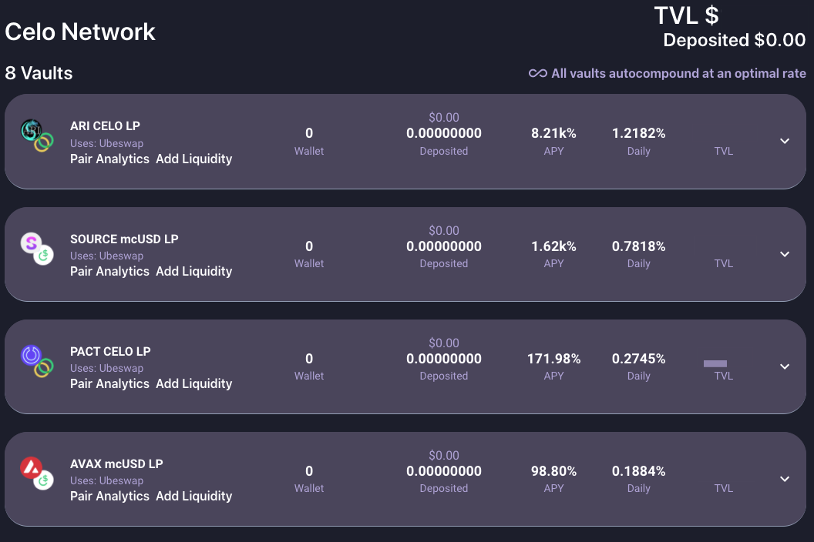
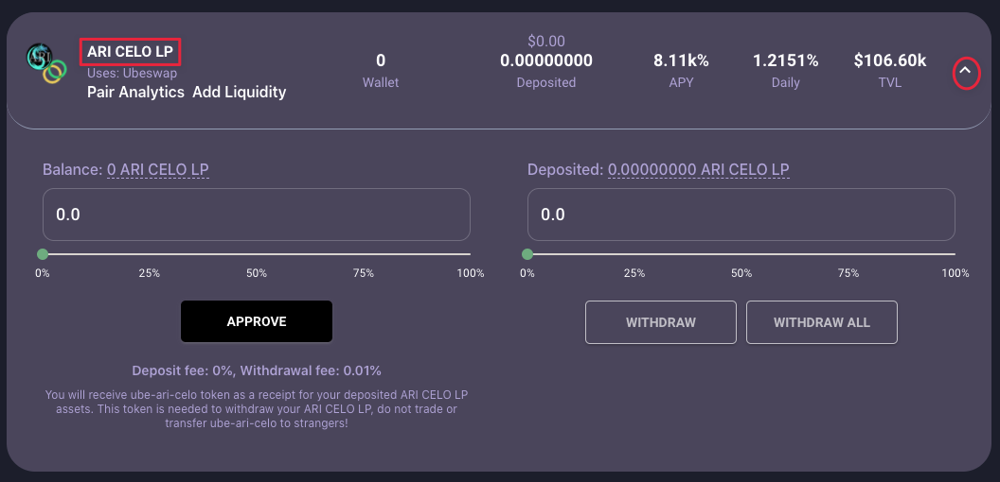
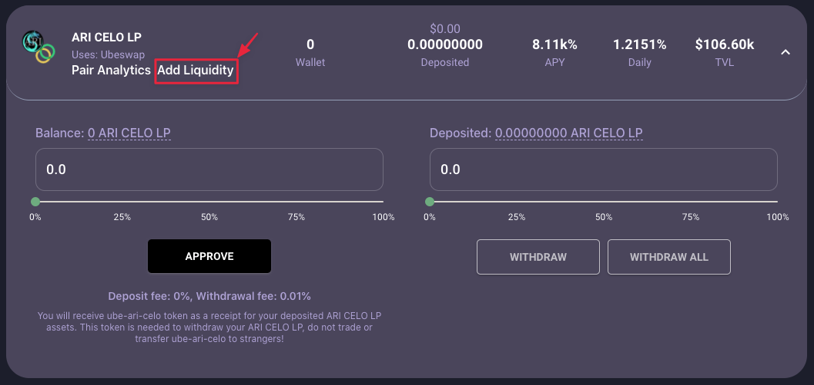

##### Select Vault and deposit LP token

###### 1. Take a look at the list of vaults

###### 2. Pick the vault that you want to deposit and expand

###### 3. Click Add Liquidity to create LP token

Add Liquidity will take you to the respective DEX to create the LP Token.

Refer [add liquidity](./add-liquidity.md) doc for Adding liquidity in Ubeswap and SushiSwap.
If the token need for add liquidity is not available please refer [swap-token](./swap-tokens.md) for token swapping in Ubeswap and SushiSwap.
