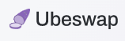
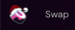

###### Swapping Tokens

Every DEX (Decentralized Exchange) allows for the token to be swapped from one token to another token.
Depending on the DEX used in the Vault please go to the respective DEX to swap the token.

### Ubeswap

[How to swap in Ubeswap](https://docs.ubeswap.org/tutorial/swapping-tokens)

### Sushiswap

[SushiSwap doc](https://docs.sushi.com/)
